# Configurazione ambiente software per NINJAM client

_A cura di [BitNet01](bit-01.net) e [AudioHackLab](audiohacklab.org)_

## Introduzione
__NINJAM__ è un software Client/Server che consente di suonare sincronizzati via Internet. Ogni partecipante può ascoltare ogni altro partecipante. Ogni utente può anche modificare il proprio mix personale a suo piacimento. NINJAM è un software con licenza Free GPL2, è multipiattaforma con client disponibili per Linux, Mac OSX e Windows.
NINJAM utilizza la compressione audio OGG Vorbis per comprimere l’audio, quindi lo invia a un server, che può quindi trasmetterlo in streaming alle altre persone presenti nella jam. Questa architettura richiede un server con larghezza di banda adeguata, ma il client non ha problemi di firewall o NAT se il server e’ pubblico. Il formato OGG Vorbis è utilizzato per le sue caratteristiche e le sue prestazioni a basso bitrate. Ogni utente riceve una copia degli altri flussi audio degli utenti, consentendo a ciascun utente di regolare il mix a suo piacimento.

### Come viene sincronizzato l’audio?
Poiché la latenza intrinseca di Internet impedisce la vera sincronizzazione in tempo reale e suonare con latenze di decine di millisecondi è infattibile, NINJAM fornisce una soluzione rendendo la latenza molto più lunga. La latenza in NINJAM è misurata in istanze, ed è ciò che lo rende interessante.

Il client NINJAM registra e trasmette le istanze divise in battute di musica sincronizzate tramite un valore di BPM che è valido per tutti i partecipanti. Proprio quando l’istanza con il suo relativo numero di battute termina di registrare, inizia a essere riprodotto sul client di tutti gli altri. Quindi, quando suoni su un’istanza, stai suonando con l’istanza precedente di tutti gli altri. Di fatto le latenze dei singoli in millisecondi vengono posticipate fino all’inizio della istanza successiva quindi sarà sempre presente un ritardo di un’istanza composta dal numero di battute scelte dai partecipanti (BPI).

Se questo suona piuttosto bizzarro, lo è, finché non ci si abitua, poi diventa piuttosto naturale!


## Jamtaba client
### Introduzione all’utilizzo
Jamtaba è un software free ed open-source, nato come fork del client di NINJAM, si differenzia da Ninjam in quanto è basato su plugin VST/AU. Pur essendo gratuito, una donazione di denaro, anche piccola, sarà sicuramente gradita dagli sviluppatori.
Una volta completata l’installazione abbiamo due possibilità o inserire il plugin sul canale master della nostra DAW oppure avviare l’applicazione standalone. In entrambi i casi l’interfaccia si presenta così:

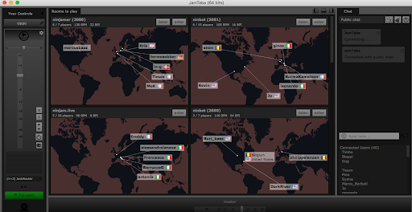

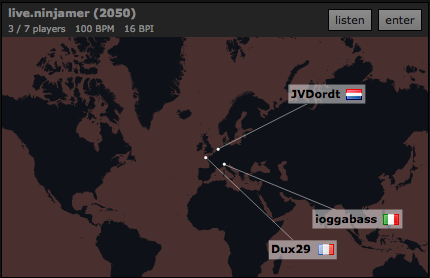

L’interfaccia presenta una serie di mappe dei server pubblici messi a disposizione dai creatori di NINJAM dove si possono vedere in tempo reale i nickname di chi è connesso e da dove si connette. Sul lato destro della mappa vediamo due bottoni. Il pulsante listen ci permette di ascoltare quello che viene suonato all’interno della stanza, enter ci permette di entrare e interagire con il nostro audio insieme agli altri utenti. 

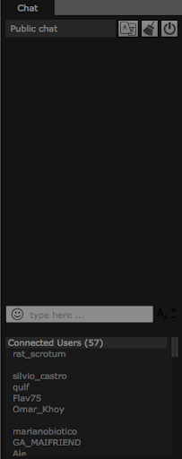

Nella parte destra vediamo la chat pubblica dove si può scrivere in tempo reale con chi è connesso. Una volta connessi al server c’è la possibilità di chattare con gli utenti che sono presenti.

Per connetterti ad un server specifico che non appare nell’elenco (come i server di AudioHackLab e di BitNet01) clicca F2 oppure vai sul menù: NINJAM > Connect with private server e apparirà una finestra di questo tipo:

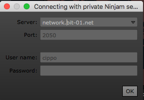

Inserisci i dati del server, il tuo user e pass (non obbligatoria) e sarai connesso al server desiderato.

Una volta connessi al server nella parte in basso troviamo tre pannelli. 
Nel pannello metronome possiamo gestire il volume del metronomo del server.


Nel secondo pannello troviamo i parametri di sincronizzazione del server, il valore del BPI è il valore di riferimento per la sincronizzazione di tutti gli utenti, nel caso illustrato dall’immagine ogni 4 battute il server farà uno streaming dell’audio che viene suonato. Ovviamente questo parametro deve essere messo in accordo con tutti gli utenti connessi per scegliere le durate delle singole parti fino ad un massimo di 64 battute per istanza. Questo parametro è fondamentale per comprendere l’interattività di NINJAM. 
Ad esempio se suono una parte di 16  battute l’altro utente remoto presente nel server riceverà le mie 16 battute solo dopo che il ciclo si è concluso nel proprio client.
Il valore di BPM ovviamente determina i battiti al minuto della sessione musicale, questo valore per risultati ideali deve essere uguale per tutti gli utenti e per tutte le DAW dove è inserito il Plugin 


Il terzo pannello che troviamo ci permette di regolare il volume generale della sessione che stiamo suonando in remoto.


__NB__: Nei vari test che abbiamo fatto alcune volte abbiamo riscontrato dei problemi con il Plugin AU, nel caso voleste utilizzare Jamtaba standalone e mandare l’audio della nostra DAW a Jamtaba vi consigliamo di utilizzare il Jack Audio Connection Kit


## Mac OSX

Nel momento in cui scriviamo questa guida, la versione di OSX che è stata usata per testare il funzionamento è High Sierra 10.13.3.
### Installare e configurare Jamtaba
Scaricate l’ultima versione aggiornata di Jamtaba a questo link, seguite la procedura di installazione senza modificare i parametri, verrà installato un software stand-alone e un plugin AudioUnit (AU). 

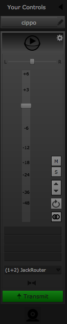

Dopo aver lanciato l’applicazione, a sinistra troviamo il master-volume di quello che stiamo trasmettendo con la possibilità di modificare il gain, il pan, o avviare lo streaming della nostra webcam. Nella versione standalone, in fondo al pannello vediamo la sorgente audio che viene mandata agli altri utenti (nell’immagine in questo caso JackRouter) nella versione AU dovremmo vedere il nome della  nostra DAW. 

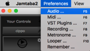

Nella versione standalone se volessimo modificare questo parametro premiamo F5 per le preferenze audio oppure andiamo in _Preferences -> Audio_

Il pannello che si apre ci permetterà di settare le nostre preferenze audio come meglio riteniamo. 
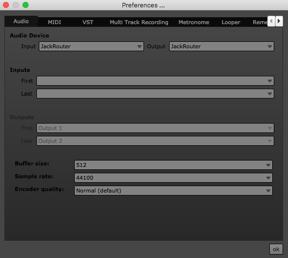

### Installare e configurare Jack Audio Connection Kit
Jack Audio Connection Kit vi permetterà di indirizzare l’output audio della vostra DAW al client NINJAM. Scaricate il file di installazione JackOSX 0.92_b3 dalla sezione download. Seguite la procedura guidata di installazione senza modificare nessun parametro. Una volta finita la procedura dovreste trovare tra le Applicazioni l’app JackPilot.
Questa è l’interfaccia: 


Cliccate sul tasto Start per avviare il JackServer, una volta avviato l’interfaccia dovrebbe apparire così: 

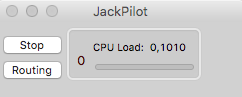

Cliccando sul tasto Routing dovrebbe apparirvi questo:

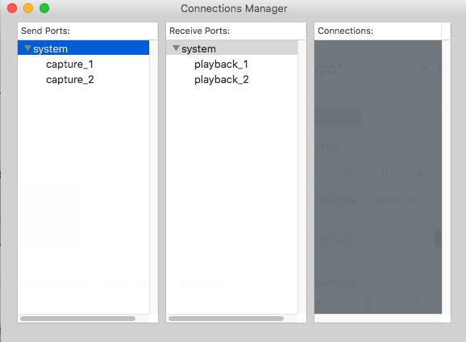
 
System sta a significare l’interfaccia audio del nostro laptop, capture è il microfono e playback sono le nostre casse. 

Ora avviamo la nostra DAW preferita da cui mandare l’audio e mettiamo tra le preferenze l’output alla scheda audio virtuale che Jack ha appena creato, per esempio in Ableton Live:


Ora avviamo Jamtaba standalone e facciamo la stessa cosa ma mettiamo l’interfaccia JackRouter come input.
__NB__: se Jamtaba era aperto prima di avviare il JackServer non vedrà la scheda, quindi chiudi Jamtaba e riaprilo. 

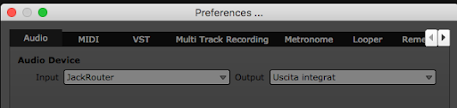

Ora su JackPilot dovremmo avere una cosa del genere: 


Clicchiamo sull’out1 della nostra DAW e facciamo doppio click sull’in1 di Jamtaba, se diventa rosso è collegato. 


Facciamo la stessa cosa per l’out2 e l’in2. Ora la nostra DAW è collegata con Jamtaba Standalone e possiamo mandare in streaming quello che desideriamo.

__NB__: Ricordati di avere lo stesso valore di BPM sia in Jamtaba che nella tua daw.

## Gnu/Linux 

Il metodo più semplice per farlo e’ aggiungere sul proprio sistema i repository di KxStudio che nel momento in cui sto scrivendo farà riferimento al sistema operativo Debian 10 (Buster) e Ubuntu 18.04 (Bionic).

Aggiorniamo la lista dei pacchetti e installiamo gli aggiornamenti.
```
sudo apt-get update
sudo apt-get upgrade
```

#### Configurazione Jack
Consigliamo di usare jack audio per ridurre le latenze, tuttavia questa guida non deve essere un punto di riferimento per jack, ci sono guide fatte meglio già in rete. 

```    
sudo apt-get install jackd2 qjackctl 
```

Se sul vostro sistema il vostro ambiente desktop utilizza pulseAudio vi consigliamo di fare l’integrazione tra jack e pulse audio, potete consultare: https://wiki.ubuntu-it.org/Multimedia/Audio/IntegrazioneJackPulseAudio

Ci sono diversi client ninjam per Gnu/Linux.

### Client Ninjam Testuale
I passaggi per installare il client testuale:

```
sudo apt-get update
sudo apt-get install git-core build-essential libasound2-dev libncurses-dev libjack-jackd2-dev libvorbis-dev

git clone https://www-dev.cockos.com/ninjam/ninjam.git
cd ninjam/ninjam/cursesclient/
make
```

Una volta compilato eseguirlo con questa sintassi:
    
 ```
 ./cninjam 5.9.104.254:8080 -jack -user anonymous:nome
 ```

Oppure se avete scelto di non usare jack:
    
```
./cninjam 5.9.104.254:8080 -user anonymous:nome
```

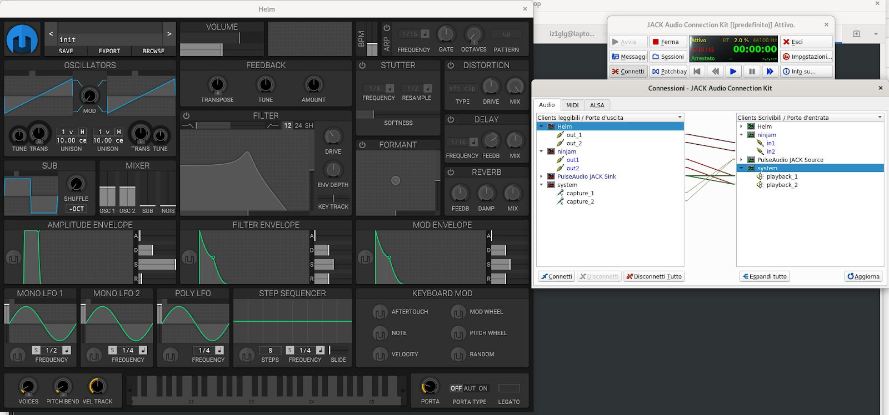

### Client Ninjam VST (Jamtaba)
Esiste anche per Linux il client Ninjam JamTaba, tuttavia la versione standalone utilizzata dal team di Jamtaba integra un VST host che fa uso degli header VST dell’ SDK di Steinberg, ma ho riscontrato problemi nel suo utilizzo con Jack, pertanto visto che Jamtaba fornisce anche il VST si è preferito utilizzare il VST di Windows 32 bit e utilizzato tramite wineasio e jack.

#### Aggiungere repo KxStudio
Il metodo più semplice per farlo e’ aggiungere sul proprio sistema i repository di KxStudio.
Seguono i passaggi per installare KxStudio:

```
sudo apt-get install apt-transport-https gpgv
wget https://launchpad.net/~kxstudio-debian/+archive/kxstudio/+files/kxstudio-repos_10.0.3_all.deb
sudo dpkg -i kxstudio-repos_10.0.3_all.deb
sudo apt install kxstudio-meta-audio-plugins kxstudio-meta-wine lmms-vst-full:i386 dssi-vst festige drumkv1-lv2
```

#### Configurazione routing audio
Lanciate _Cadence_.  
Come Jack bridge verificate sia caricato come tipo `ALSA -> Loop -> Jack`
Ora cliccate su configure per configurate la vostra scheda audio nel menu alsa, salvate e uscite.
Cliccate su start per far partire Jack. e verificate che lo stato di Jack sia `Started` 

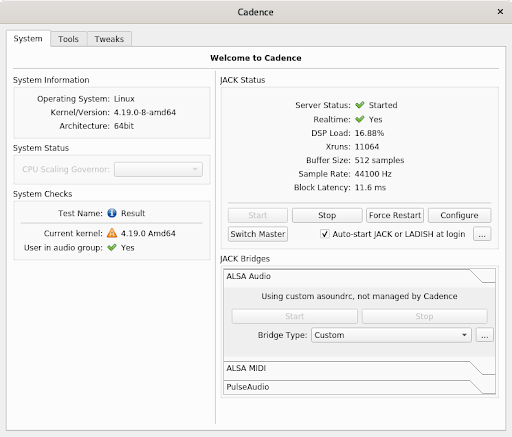

#### Installazione JamTaba
A questo punto scaricare il client VST jamtaba su Linux disponibile a questo link ed installarlo come per windows (esegui l’exe con wine).

Creare link simbolico nella home per i VST:

```
cd $HOME
ln -s .wine/drive_c/Programmi/VSTPlugins/ VST
```

A questo punto attraverso Carla (installato con i pacchetti di kxstudio) aprire la dll di Jamtaba VST/JamtabaVST2.dll


## Windows
Per quanto riguarda il sistema operativo Windows abbiamo identificato due differenti soluzioni e potete scegliere quella più adatta alla vostra configurazione software e hardware. La prima, più semplice, prevede l’utilizzo di Jamtaba. Potete riferirvi alla documentazione relativa al Mac Osx, al posto di un plugin AU utilizzerete un VST2. Noi abbiamo testato la versione di Jamtaba a 32 bit. Se avete problemi nell’esecuzione di Jamtaba sul vostro sistema, optate per la soluzione seguente.

### Installare i driver ASIO4ALL
Nel momento in cui scriviamo questa guida, la versione dei driver [ASIO4ALL](http://www.asio4all.org/)  è la 2.14.
Scaricate il file eseguibile [ASIO4ALL_2_14_English.exe](http://www.asio4all.org/downloads_11/ASIO4ALL_2_14_English.exe) e seguite la procedura guidata senza modificare le scelte proposte.

### Installare e configurare Jack Audio Connection Kit
Jack Audio Connection Kit vi permetterà di indirizzare l’output audio della vostra DAW al client NINJAM. Scaricate il file di installazione [Jack_v1.9.11_32_setup.exe](https://jackaudio.org/downloads/) (noi abbiamo usato la versione a 32 bit) dalla sezione download. Anche in questo caso, seguite la procedura di installazione. Andate nella cartella `C:\Program Files (x86)\Jack` e eseguite il file `qjackctl.exe`.


Questa è l’interfaccia del Jack Audio Connection Kit.

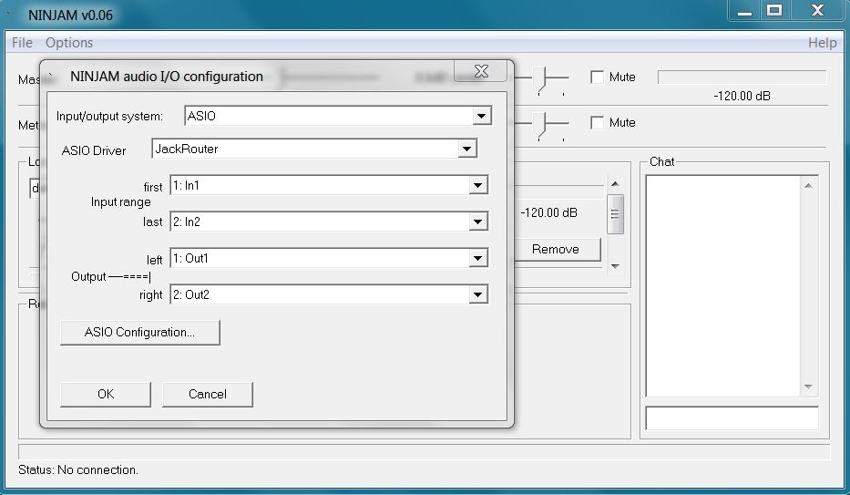

Premete il tasto Setup per selezionare come interfaccia i driver ASIO4ALL che avete appena installato.
Avviate il server Jack premendo Start. In caso di errore, provate a premere Start una seconda volta.

### Configurazione client NINJAM
Scaricate il file [ninjam_winclient_006.zip](https://www.cockos.com/ninjam/downloads/ninjam_winclient_006.zip), al suo interno troverete una cartella chiamata NINJAM, estraete i file dove preferite, eseguite il file ninjam.exe.
Scegliete il menu Options e poi Audio configuration. Scegliete ASIO come Input/output system e Jack Router come ASIO Driver.

### Routing audio
Useremo Jack per indirizzare il flusso audio dalla DAW al client NINJAM. Occorre configurare la DAW e indirizzare il suo flusso audio in uscita verso il server Jack, identificato con il nome JackRouter. Qui utilizziamo [Podium Free](https://zynewave.com/podium-free/), a titolo di esempio.

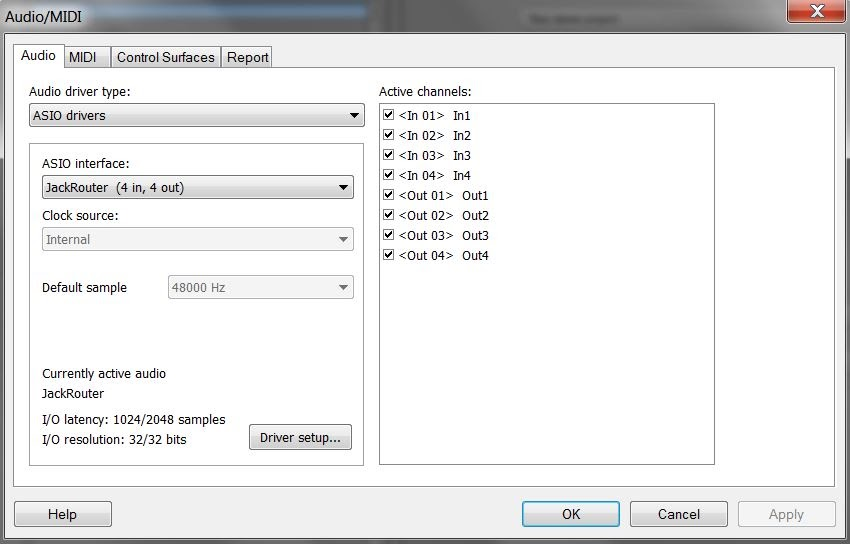

Torniamo a Jack e premiamo il tasto Connection per accedere alla finestra dove si possono stabilire le connessioni tra le porte di uscita e di ingresso. Premendo Disconnect All si scollegano tutte le connessioni esistenti. 

Per creare nuove connessioni basterà selezionare le porte desiderate e premere il tasto Connect.

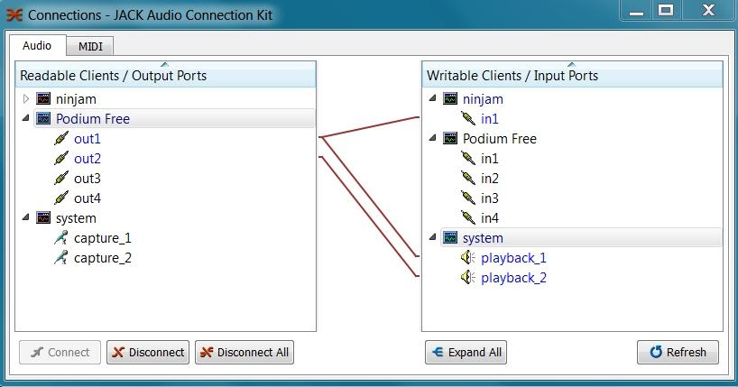
