# NINJAM client installation guide

_Edited by [BitNet01](bit-01.net) and [AudioHackLab](audiohacklab.org)_

## Introduction

__NINJAM__ is a Client/Server software that allows you to play synchronized via the Internet.
Any participant can listen to any other participant. Users can also edit his own personal mix as they wish. NINJAM is a software with [Free Software](https://it.wikipedia.org/wiki/Software_libero) GNU GPL2 license to protect the four fundamental freedoms, it is cross-platform with clients available for Linux, Mac OSX and Windows. NINJAM uses OGG Vorbis audio compression to compress audio, then streams it to a NINJAM server, which can then stream it to the other people in your jam. This architecture requires a server with adequate bandwidth, but has no firewall or NAT issues. OGG Vorbis is utilized for its
great low bitrate characteristics and performance. Each user receives a copy of other users audio streams, allowing for each user to adjust the mix to their liking, allowing each user to adjust the mix to their liking.

## How audio is synchronized?
Since the inherent latency of the Internet prevents true realtime synchronization of the jam and playing with latencies of tens of milliseconds is in fact impossible, NINJAM provides a solution by making latency (and the weirdness) much longer. Latency in NINJAM is measured in measures, and that's what makes it interesting.
The NINJAM client records and streams instances divided into bars of synchronized music through a BPM value that is valid for all participants. Just when the interval with its relative number of bars ends recording, it starts to be reproduced on everyone else's client. So when you play on one interval, you are playing with the previous interval of everyone else.
In fact, the latencies of the individuals in milliseconds are postponed until the beginning of the nextinterval so there will always be a delay of an interval consisting of the number of bars chosen by the participants (BPI).
If this sounds pretty bizarre, it sort of is, until you get used to it, then it becomes pretty natural.


## Jamtaba client
Jamtaba is a free and open-source software, born as a fork of the NINJAM client and is based on VST/AU plugins. Even if it is free, even a small donation of money will certainly be appreciated by the developers.
Once the installation is complete we have two possibilities: insert the plugin on the master channel
of our DAW or start the standalone application. In both cases the interface looks like this:


The interface presents a series of maps of public servers made available by the creators of NINJAM where you can see in real time the nicknames of those who are connected and from where they connect. On the right side of the map we see two buttons. The listen button allows us to listen to what is played inside the room, the enter button allows us to enter and interact with our audio
together with other users.


On the right side we see the public chat where you can write in real time with who is connected. Once connected to the server there is the possibility to chat with the users who are present.To connect to a specific server that does not appear in the list (such as the AudioHackLab andBitNet01 servers) click F2 or go to the menu: NINJAM> Connect with private server and a window
of this type will appear:


Enter the server data, your user and pass (not mandatory) and you will be connected to the desired
server.
Once connected to the server in the lower part we find three panels. In the metronome panel we can
manage the metronome volume of the server.

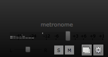

In the second panel we find the server synchronization parameters, the BPI value is the reference
value for the synchronization of all users, in the case illustrated by the image every 4 bars the server
will stream the audio that is played. Obviously this parameter must be put in agreement with all
connected users to choose the durations of the individual parts up to a maximum of 64 bars per
instance. This parameter is fundamental for understanding the interactivity of NINJAM. For
example, if I play a part of 16 bars, the other remote user present in the server will receive my 16
bars only after the cycle has ended in his client. The BPM value obviously determines the beats per
minute of the music session, this value for ideal results must be the same for all users and for all
DAWs where the Plugin is inserted.

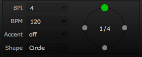

The third panel that we find allows us to adjust the general volume of the session that we are
playing, remotely.

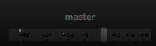

__Note__: In the various tests we've done, sometimes we've encountered problems with the AU Plugin,
if you want to use standalone Jamtaba and send the audio of our DAW to Jamtaba we recommend
using the Jack Audio Connection Kit.


## Mac OSX
At the time of writing this guide, the version of OSX that was used to test the operation is High Sierra 10.13.3. 

### Jamtaba installation and configuration
Download the latest updated version of Jamtaba, follow the installation procedure without changing any parameters, a stand-alone software and an AudioUnit (AU) plugin will be installed.


After launching the application, on the left we find the master-volume of what we are streaming with the possibility of changing the gain, the pan, or starting the streaming of our webcam.
In the standalone version, at the bottom of the panel we see the audio source that is sent to other users (in the image, in this case JackRouter) in the AU version we should see the name of our DAW.


In the standalone version, if we want to modify this parameter, press F5 for audio preferences or go
to _Preferences -> Audio_
The panel that opens will allow us to set our audio preferences as we prefer.


### Install and configure Jack Audio Connection Kit
Jack Audio Connection Kit allows you to direct the audio output of your DAW to the NINJAM client. Download the JackOSX 0.92_b3 installation file from the download section. Follow the installation wizard without changing any parameters. Once the procedure is finished you should find the JackPilot app among the Applications. 
This is the interface:

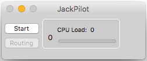

Click on the Start button to start the JackServer, once started the interface should look like this:


By clicking on the Routing button, this should appear:


 
System means the audio interface of our computer, capture is the microphone and playback are our speakers.
Now we start our favorite DAW from which to send the audio and we put in the preferences the output to the virtual sound card that Jack has just created, for example in Ableton Live:

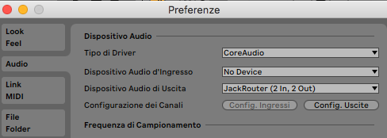

Now let's start Jamtaba in standalone and do the same thing but put the JackRouter interface as input.
__Note__: if Jamtaba was open before starting the JackServer it will not see the sound card, so close Jamtaba and reopen it.


Now on JackPilot we should have something like this:

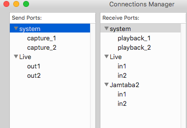

Click on the out1 of our DAW and double click on Jamtaba's in1, if it turns red, it's connected.

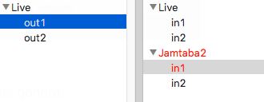

Do the same for out2 and in2. Now our DAW is connected with Jamtaba Standalone and we can stream what we want.
__Note__: Remember to have the same BPM value in both Jamtaba and in your DAW.


## Gnu/Linux 

The easiest way to do this is to add the KxStudio repositories to your system which at the time of writing it refer to the Debian 10 (Buster) and Ubuntu 18.04 (Bionic) operating systems.
There are several Ninjam clients for Gnu / Linux, to follow we will take into consideration the textual client, the QT one and the more well-known Jamtaba one.

#### Jack Configuration (optional for textual client and for QT, but recommended)

In order to reduce latencies, we recommend using Jack audio, however this guide is not intended to be a reference point for Jack, on the net you can find more in-depth information on the subject, for this reason we limit ourselves here to simply installing the tools.

```    
sudo apt-get update
sudo apt-get install jackd2 qjackctl 
```

### Ninjam Textual Client  
Steps to install the text client:

```
sudo apt-get update
sudo apt-get install git-core build-essential libasound2-dev libncurses-dev libjack-jackd2-dev libvorbis-dev  

git clone https://www-dev.cockos.com/ninjam/ninjam.git
cd ninjam/ninjam/cursesclient/
make
sudo cp cninjam /usr/bin/
```

Assuming that you want to connect to the Ninjam server live.audiohacklab.org:2049 on the terminal
use this syntax::
    
 ```
 cninjam live.audiohacklab.org:2049 -jack -user anonymous:nome
 ```

Or, if you choose not to use Jack:   

```
cninjam live.audiohacklab.org:2049 -user anonymous:nome
```


### Ninjam QT Client (wahjam)  
Steps to install the qt client:  

```
sudo apt-get update
sudo apt-get install git-core build-essential qt5-default
portaudio19-dev libportmidi-dev libresample1-dev libvorbis-dev
graphicsmagick-imagemagick-compat
git clone https://github.com/wahjam/wahjam.git
cd wahjam
qmake
make
sudo cp qtclient/wahjam /usr/bin/
convert qtclient/jammr.ico -thumbnail 64x64 -flatten
qtclient/wahjam.png
sudo cp qtclient/wahjam.png /usr/share/icons/
cat <<EOF > qtclient/wahjam.desktop
[Desktop Entry]
Type=Application
Exec=/usr/bin/wahjam
Name=Wahjam
GenericName=Wahjam - Play online music jam sessions.
Icon=wahjam.png
Terminal=false
Categories=Music
EOF
sudo cp qtclient/wahjam.desktop /usr/share/applications/
```

To run it, search for Wahjam in the menu or run it from the terminal by calling:  

```
wahjam
```

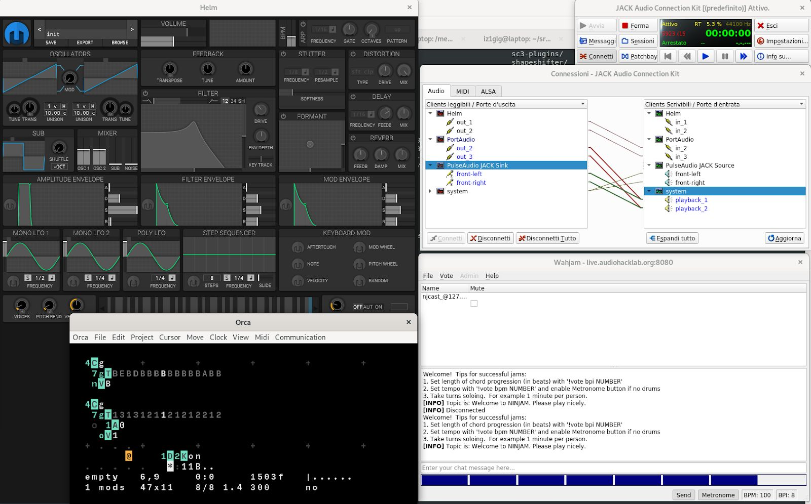

### Ninjam VST Client (Jamtaba)
The Ninjam JamTaba client also exists for Linux, however the standalone version used by the Jamtaba team integrates a VST host that makes use of the VST headers of the Steinberg SDK, but we've encountered problems in using it with Jack, therefore since Jamtaba also provides the VST, we prefer to use the 32 bit Windows VST and using trough Wineasio and Jack.

### Adding repo KxStudio
The easiest way to do this is to add KxStudio repositories to your system. Following are the steps to
install the tools of the KxStudio suite:

```
sudo apt-get install apt-transport-https gpgv
wget https://launchpad.net/~kxstudio-debian/+archive/kxstudio/+files/kxstudio-repos_10.0.3_all.deb
sudo dpkg -i kxstudio-repos_10.0.3_all.deb
sudo apt-get update
sudo apt install kxstudio-meta-audio-plugins cadence drumkv1-lv2 carla-git carla-bridge-win32 carla-vst-wine wineasio
```

### Audio Routing Configuration
Open _Cadence_:


In the Jack Bridge section, verify that the _ALSA->Loop->Jack_ is loaded and then click _Start_. In the Jack Status Section, click on configure and configure your sound card (this part is very important otherwise jack remains deaf and dumb) by moving to the Alsa menu to select your sound card, once
done click on OK to return to the previous Cadence window.

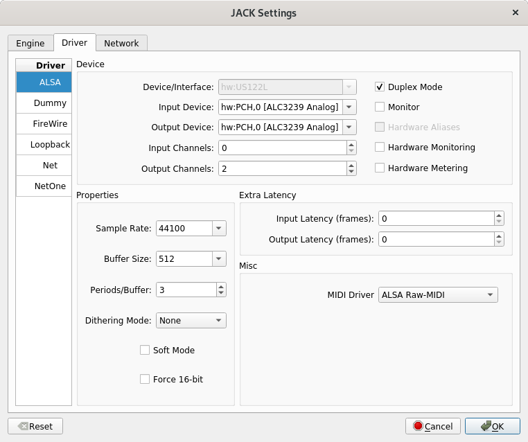

Click on Start to start Jack and check that Jack's status is `Started`, also click on the Auto-start checkbox. Now click on the `tweak` menu and on WineASIO click on `Autostart server` and on `Apply Now`, click on OK and close Cadence.   
Open terminal and register the wineasio library on wine, with the command:

```
wine regsvr32 /opt/wine-stable/lib/wine/wineasio.dll.so
```

### JamTaba Installation
At this point download the VST client [Jamtaba.2.32.bits.installer.exe](https://github.com/elieserdejesus/JamTaba/releases/download/v2.1.10/Jamtaba.2.32.bits.installer.exe) and install it as for Windows (run the exe via /usr/bin/wine) and follow the guided procedure without modifying the choices proposed, take note of the exact path of the VSTPlugins folder (may vary), at the end of the installation Jamtaba will start in standalone mode with its vst host, close the window.  
Create a symbolic links in the home folder for the VSTs (using the annotated path) and start Carla:

```
cd $HOME
ln -s .wine/drive_c/Program\ Files\ \(x86\)/Steinberg/VSTPlugins/ VST
carla
```

At this point through Carla open the Jamtaba VST / JamtabaVST2.dll dll and properly connect the
inputs and outputs, respectively to your instruments and audio speakers.

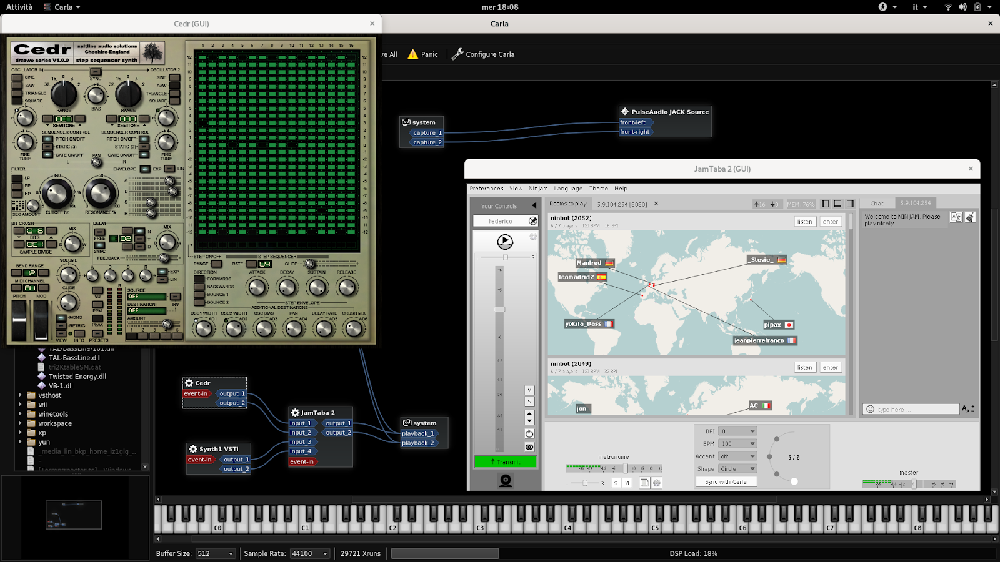
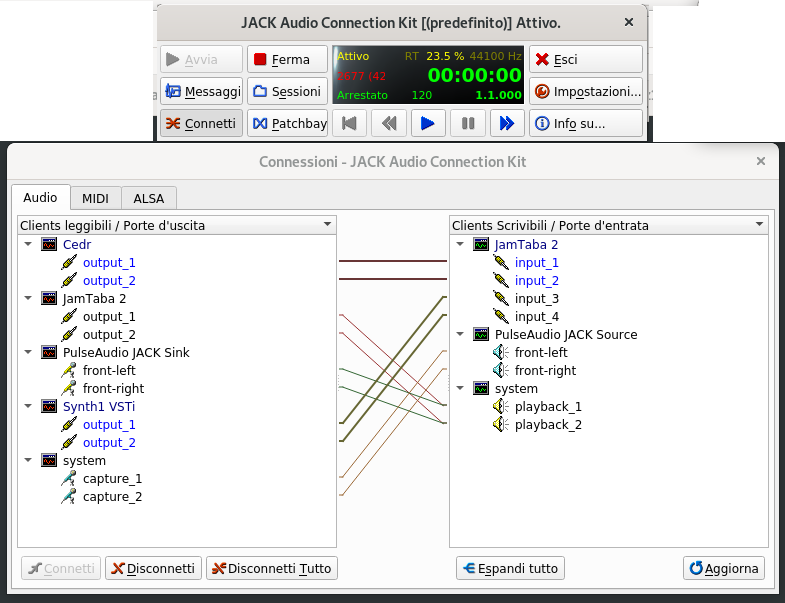


## Windows
About Windows' operating system, we've identified two different solutions and you can choose the one that best suits your software and hardware configuration. The first, simpler, involves the use of Jamtaba. You can refer to the documentation related to Mac Os X, instead of an AU plugin, use a
VST2. We tested the 32-bit version [Jamtaba.2.32.bits.installer.exe](https://github.com/elieserdejesus/JamTaba/releases/download/v2.1.10/Jamtaba.2.32.bits.installer.exe).  
If you have problems running Jamtaba on your system, opt for the following solution:

### ASIO4ALL Driver Installation
As of this writing, the ASIO4ALL driver version is 2.14. Download the executable file [ASIO4ALL_2_14_English.exe](http://www.asio4all.org/downloads_11/ASIO4ALL_2_14_English.exe) and follow the guided procedure without modifying the proposed choices.

### Jack Audio Connection Kit installation
Jack Audio Connection Kit will allow you to direct the audio output of your DAW to the NINJAM client. Download the installation file [Jack_v1.9.11_32_setup.exe](https://jackaudio.org/downloads/) (we have used the 32-bit version) from the download section. Again, follow the installation procedure. Go to the `C:\Program Files(x86)\Jack` folder and run the `qjackctl.exe` file.

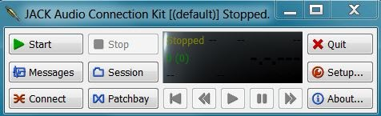

This is the Jack Audio Connection Kit interface:

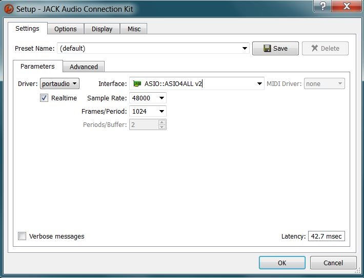

Click on Settings to select the ASIO4ALL drivers as the interface. Start the Jack server by pressing Start. In case of error, try pressing Start a second time.

### NINJAM Client Configuration
Download the [ninjam_winclient_006.zip](https://www.cockos.com/ninjam/downloads/ninjam_winclient_006.zip) file, inside you will find a folder called NINJAM, extract the files where you prefer, run the ninjam.exe file.
Choose the Options menu and then Audio configuration. Choose ASIO as the Input/Output system and Jack Router as the ASIO Driver.


### Audio Routing
We'll use Jack to route the audio stream from the DAW to the NINJAM client. You need to configure the DAW and direct its outgoing audio stream to the Jack server, identified by the name JackRouter. Here we're using [Podium Free](https://zynewave.com/podium-free/), as an example.


Let's go back to Jack and press the Connection button to access the window where you can establish the connections between the output and input ports. Pressing Disconnect All disconnects all existing connections. To create new connections, simply select the desired ports and press the
Connect button.


