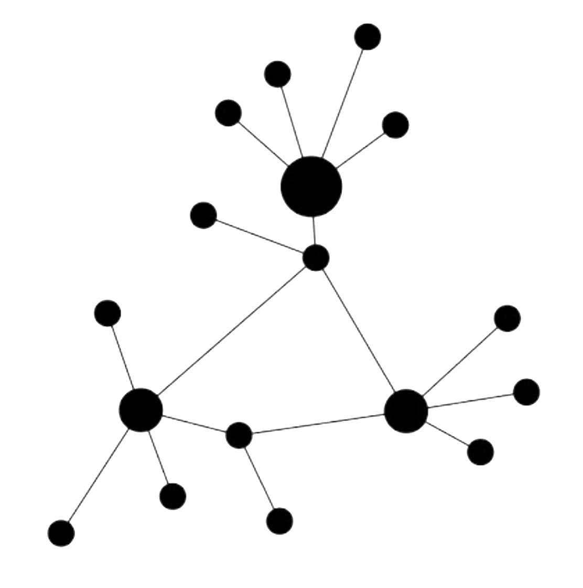

# Rhizomatic mutual aid []

We are experiencing a dystopian reality that until a few months ago we could only trace in some sci-fi movies.
The body becomes obsolete, our lives enters a purely cognitive dimension. Individuals alternate between the obligation to go to work on platforms with algorithms that calculate the percentage of attention and to find forms of home entertainment.
Our still bodies, in front of LCD screens are trying to reunite virtually and the great social network platforms are toasting for their profits.
Musicians, makers, hackers, programmers, VJs and DJs used to collective social moments have been forced to make these moments purely individual.
We have tried to bridge the distance with the public through direct streaming of singles, one at a time, each with its own portion of time available. But the true collective artistic process of action and fruition cannot be rendered virtually.
Networking means creating relationship networks, sharing experiences and ideas, creating contexts in which people can feel free to communicate and create artistically so that the broadcaster and recipient, artist and public, get confused and lose their original meaning.

The definition of _mutual_ starts from the Latin word mutuus and the word aid which indicates help in times of need. Mutual aid companies are voluntary mem-
bership-based institutions in which members adhere to the principle of mutual aid, non-profit or individual enrichment. Given the historical origin of the term, today wewant to give it a meaning of human solidarity made up of virtually joint bodies that develop tools to help all of us.

The term rhizomatic derives from _rhizome_ which in botany is a particular type of root where any point is connected to any other point in a non-hierarchical way:
there is no center, no direction, only concatenations. The rhizome expands in all directions creating multiplicity. In philosophy Gilles Deleuze and Felix
Guattari place the concept of rhizome at the center of a widespread organizational model capable of describing and changing social and cultural processes.The two French philosopher recognize the real need to become "rhizomatic" to truly creative open-thinking, in order to reverberate in a potentially advantageous way both for the individual and for the community.

BitNet01 and Audio HackLab, two collectives constituted by people living hundreds of chilometers apart, have felt the need to play together even in isolation, devising escape lines and technical solutions outside from commercial logic and proprietary platforms. For this purpose we have set up two NINJAM servers. NINJAM is a software that allows to play synchronized via the Internet. Any participant can listen to any other participant and edit his own personal mix. 

[Here](ninjam/ninjam_installation_guide.md) you can find more info and the NINJAM client installation guide.

The NINJAM servers adresses are the following:  
name: _live.audiohacklab.org_ port: _2049_  
name: _network.bit-01.netport_: _2049_  

Audio can be streamed directly from [AudioHackLab website](https://audiohacklab.org/live/) or [BitNet01 website](https://bit-01.net/live/)
